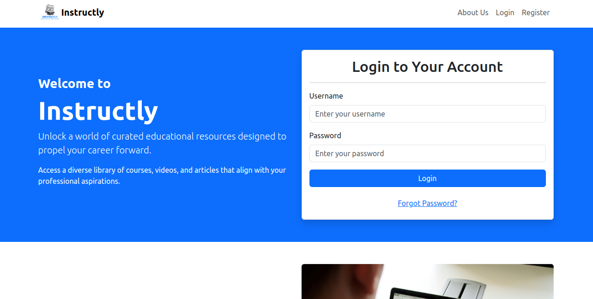
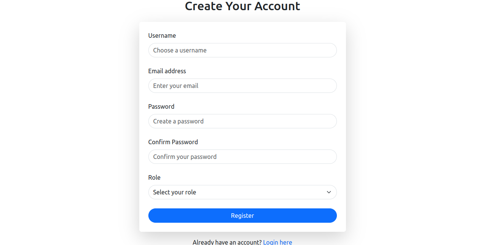
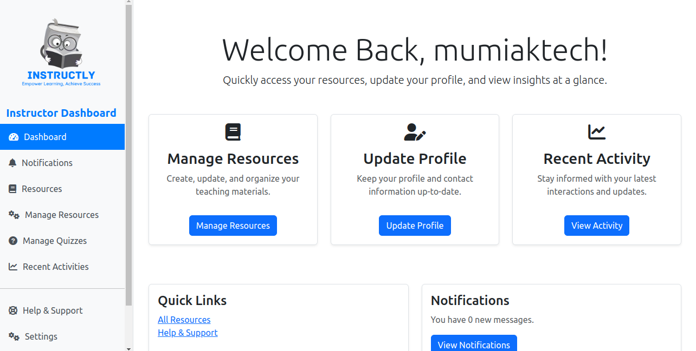
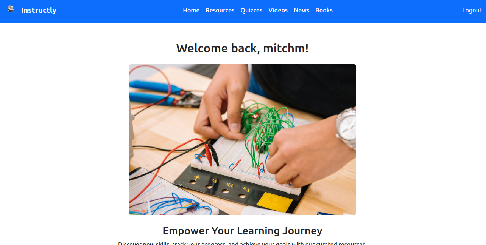

# Instructly

Instructly is an online platform designed to facilitate learning by providing instructors and students with tools to share resources, create and take quizzes, and track progress. The system allows for a seamless, interactive educational experience for both instructors and students.

## Table of Contents

- [Inspiration and Background](#inspiration-and-background)
- [Technical Challenges and Solutions](#technical-challenges-and-solutions)
- [Installation](#installation)
- [Usage](#usage)
  - [Instructor Dashboard](#instructor-dashboard)
  - [Student Dashboard](#student-dashboard)
  - [Create Superuser & Admin Roles](#create-superuser--admin-roles)
- [Screenshots](#screenshots)
- [Testing](#testing)
- [Future Enhancements](#future-enhancements)
- [Contributing](#contributing)
- [Licensing](#licensing)

## Inspiration and Background

The idea behind **Instructly** was born out of my curiosity about how Learning Management Systems (LMS) are built. I wanted to create something that didn’t require courses to be built from scratch but allowed for resources and content to be pulled from external sources. As an instructor, you can easily share educational content you find useful, and students can access those resources to enhance their learning.

Throughout this project, I aimed to create a tool that makes learning more accessible and interactive. My goal was to provide an intuitive platform where instructors could manage resources and quizzes effortlessly, and students could easily engage with the material and test their knowledge with quick quizzes.

In developing **Instructly**, I learned a lot about the nuances of managing user roles, permissions, and building real-time functionalities such as notifications and instant quiz feedback.

## Technical Challenges and Solutions

Building this project presented several technical challenges:

- **Resource Management**: Initially, I struggled with designing a system where instructors could upload various types of learning materials. I resolved this by utilizing Django's built-in file handling capabilities, which allowed for seamless uploads of PDFs, videos, and documents.
  
- **Quiz System**: Designing a flexible quiz system was a major focus. I created multiple models to handle different types of questions, and I integrated automatic grading so that students receive real-time feedback. Django's ORM was particularly useful in managing the complexity of storing, retrieving, and evaluating quiz data.

- **Real-time Notifications**: One of the more difficult parts of the project was implementing real-time notifications. This required integrating Django Channels with WebSockets, allowing instructors to receive updates on student activities instantly. After several iterations, I successfully built a reliable notification system.

- **Student and Instructor Dashboards**: The design challenge was to make both dashboards simple but feature-rich. For instructors, the ability to manage quizzes and resources in one place was key. For students, the dashboard had to be clean and intuitive to encourage them to engage with learning materials without feeling overwhelmed.

## Installation

To get started with Instructly, follow these steps:

1.Clone the repository:

```bash
git clone https://github.com/mumiak-mitch/InstructlyLMS
```

2.Navigate into the project directory:

```bash
cd InstructlyLMS
```

3.Install the necessary dependencies:

```bash
pipenv install
```

4.Apply the migrations:

```bash
python manage.py migrate
```

5.Create a superuser for the admin panel:

```bash
python manage.py createsuperuser
```

6.Start the development server:

```bash
python manage.py runserver
```

## Usage

### Instructor Dashboard

Instructors can:

- Share educational resources like videos, documents, and links.
- Create and manage quizzes with automatic grading.
- Track student performance through real-time notifications and activity logs.
- Manage the resources they’ve shared (edit/delete).

### Student Dashboard

Students can:

- Access and search educational resources shared by instructors.
- Participate in quizzes and receive instant feedback on their performance.
- Explore additional resources such as news articles, books, and tutorials pulled from external APIs (e.g., YouTube API for video tutorials, Books API for educational content).

### Create Superuser & Admin Roles

1. **Create a Superuser**  
   Run the following command to create a superuser for the Django admin:

   ```bash
   python manage.py createsuperuser
   ```

   Use the superuser account to log in to the Django admin dashboard.

2. **Create Roles: Instructor and Student**  
   In the admin dashboard, create roles with appropriate permissions:
   - **Instructor**: Assign permissions to create quizzes, manage resources, and track student activity.
   - **Student**: Assign permissions to access learning resources and take quizzes.

## Screenshots

Here are some screenshots of the platform in action:






## Testing

Instructly includes a comprehensive testing suite with unit, integration, and end-to-end (E2E) tests to ensure platform reliability.

### Running Unit Tests

```bash
python manage.py test
```

### Running Integration Tests

```bash
python manage.py test
```

### Running E2E Tests with Selenium

Ensure you have Selenium installed:

```bash
pip install selenium
```

Then, run E2E tests:

```bash
python manage.py test --tag=selenium
```

## Future Enhancements

Although **Instructly** offers a full-featured learning platform, there are several features I plan to introduce in future iterations:

- **Advanced Analytics**: Developing more comprehensive analytics tools to track learning trends and student performance over time.
- **Mobile App**: Building a dedicated mobile app for better accessibility and user experience on mobile devices.
- **More API Integrations**: Expanding the platform to integrate additional educational resources from various APIs (e.g., eBooks, webinars).

## Personal Growth

This project has been a huge learning experience for me, both in terms of technical skills and project management. I deepened my understanding of Django, user roles, and permission handling. The process of integrating external APIs was particularly challenging but also rewarding, as it opened up new ways to enhance the user experience. I'm excited about the next steps and how **Instructly** will evolve over time.

## Contributing

We welcome contributions! Here's how you can get involved:

1. Fork the repository.
2. Create a new branch for your feature or bugfix: `git checkout -b your-branch-name`.
3. Commit your changes: `git commit -m 'Add new feature'`.
4. Push to your branch: `git push origin your-branch-name`.
5. Create a pull request.

## Licensing

This project is licensed under the MIT License. See the [LICENSE](LICENSE) file for more details.
